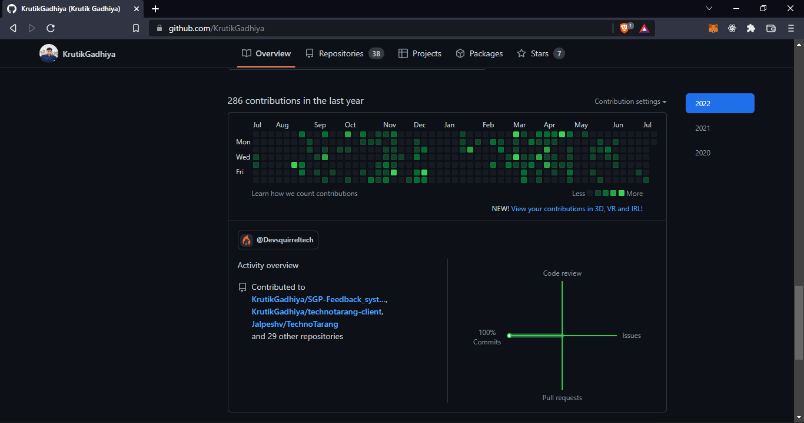

# Internship - II (IT446)

---

**I did my 7^th^ Sem Internship at [Devsquirrel Technologies Pvt. Ltd.](http://certopus.com), Certopus was the project on which i worked the most during the internship period**

---

## My Role

<b>Position Title:</b> Full Stack Developer Intern
<b>Duration: </b> 3 months

- During these 3 months i worked on Backend which was in NodeJS, AWS, Lambda, DynamoDB, Supabase
- Also Frontend which was in NextJS and ReactJS

---

## Tools And Technologies

- ReactJS / NextJS
- NodeJS
- AWS
- DynamoDB
- Lambda
- Supabase
- Redis

---

## My Work

### 1^st^ month

During 1st month initially the task which were given to includes understanding the project as well as updating and modifying the project according to requirement.

**1^st^ Week:** Understanding the Backend Project **_(Backend)_**
**2^nd^ Week:** Optimizing the APIs **_(Backend)_**
**3^rd^ Week:** Adding more API endpoint and Fixing Bugs **_(Backend)_**
**4^nd^ Week:** Understanding the Frontend Project and Optimizing the Site load time **_(Frontend)_**

### 2^nd^ month

**1^st^ Week:** Updating Certificate Page in NextJS site **_(Frontend)_**
**2^nd^ Week:** Adding WhiteLabelling Feature **_(Backend)_**
**3^rd^ Week:** SMTP configuration for the project, Analytics APIs **_(Backend)_**
**4^nd^ Week:** Learning about Blockchain and NFT, minting NFT to Polygon blockchain, Finding a Cheaper way to Mint NFT to Blockchain **_(Backend)_**

### 3^rd^ month

**1^st^ Week:** Wallet APIs **_(Backend)_**
**2^nd^ Week:** Integrating Stripe checkout for subscription based payment **_(Backend)_**
**3^rd^ Week:** Implementing Stripe Webhook for getting Events on the backend **_(Backend)_**
**4^nd^ Week:** Further optimizing NextJS site by removing unused styles and components **_(Frontend)_**

---

